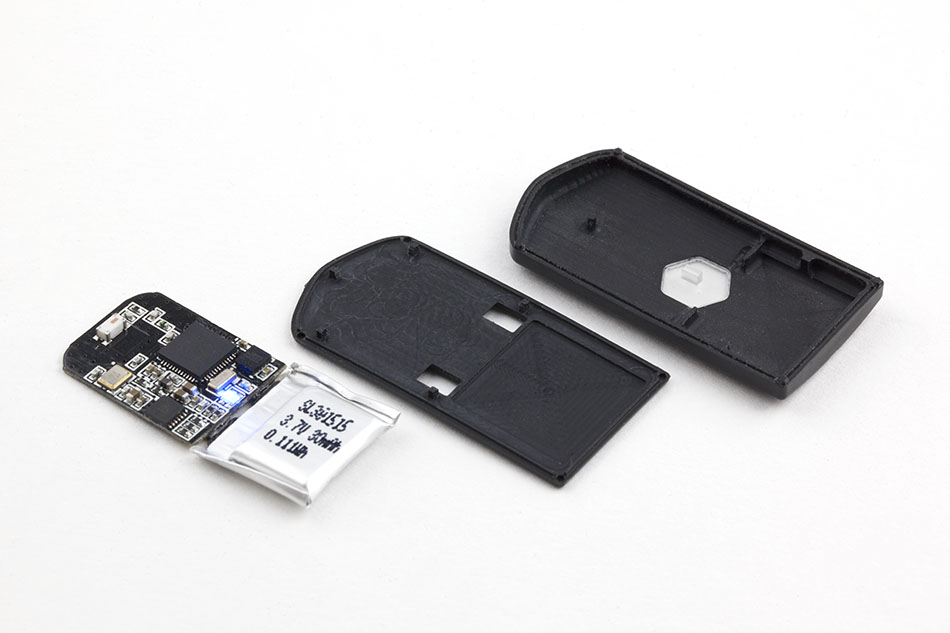

#Punch Training Coach
This is a feedback and training device to help a boxer optimize punching force, reaction time, workout intensity, and endurance.

##Minimum Viable Product
* (Done) Detect, record, and display g-force of a punch from a target
* (Done) Build with Arduino 101 with built-in accelerometer and Bluetooth

##Additional Software Features
* (Done) Pattern recognition to detect straights/jabs, hooks, and uppercuts
* (Done) Bluetooth communication with computer or phone
* Call out punch force instead of displaying
* Audible prompt for punches
* Measure reaction time after audible prompt
* Take video with forward-facing camera and sync to data feed

##Additional Features requiring Hardware
* Use a [load cell](http://www.digikey.com/product-detail/en/te-connectivity-measurement-specialties/FC2311-0000-0500-L/MSP6953-ND/809399) to compare directly measured force to force calculated from g-force detection.
* Utilize [Arduino built-in IMU](https://www.arduino.cc/en/Reference/CurieIMU) to measure g-force to 16g, [ADXL377](https://www.adafruit.com/products/1413?gclid=CISd382-_8wCFVNqfgodWAcAMg) to measure from 16g to 200g
* Multiple accelerometers wired to one Arduino could select sensor with the highest force and compare data to localize the punch (head/body)
* Connect heartrate strap and pace punches to match target HR zone
* Acceleration sensor on hands could add a lot of useful data:
	- Hand speed
	- Inefficiency - loading up before punching
	- Break out reaction time vs. time to target into separate measurements
* Pressure sensors in feet could correlate weight transfer to punching power

##Problems and ideas
*  [Load cell](http://www.digikey.com/product-detail/en/te-connectivity-measurement-specialties/FC2311-0000-0500-L/MSP6953-ND/809399)  has an output of 100mV, but the Arduino wants analog inputs of 3.3V. I think one of [these amplifiers](http://www.robotshop.com/en/strain-gauge-load-cell-amplifier-shield-2ch.html?gclid=CNqAhNSPhc0CFZNhfgodKigMhQ
) should solve the problem.
* Interesting [sensor for cheap calibration](https://www.sparkfun.com/products/8685). You could also use this to give accuracy points for landing a punch on the button.
* Hold all accelerometer values in a 4x4 array (currently held in variables)

|| total | ax | ay | az
|---|---|---|---|---
| current_reading  | [0,0] | [0,1] | [0,2] | [0,3]
| previous_reading | [1,0] | [1,1] | [1,2] | [1,3]
| previous_punch   | [2,0] | [2,1] | [2,2] | [2,3]
| peak_hold        | [3,0] | [3,1] | [3,2] | [3,3]

##Math
* Calculating energy from a pendulum:
  - http://www.endmemo.com/physics/spendulum.php
  - http://www.wikihow.com/Calculate-Kinetic-Energy
- Maximum punch speed = 10m/s
- Arm mass = 6 kg
- Kinetic energy = 300J
- Similar reference punch:
	- 68lb weight dropped from ceiling on a 1m pendulum – or – 
	- 45 lb weight on a 1.5m pendulum –or-
	- 34 lb weight on a 2.0m pendulum

##Similar Products and Projects
* [Puncho boxing glove](http://www.industrial-design-germany.com/innovations/intelligent-boxing-glove-puncho.html) (development prototype)

* [StrikeTec](http://efdsports.com/) – Really slick UI, but no indication that it will ever ship: 

* [Hysko](https://www.hykso.com/) – taking pre-orders for Sept 2016 ship date @ $129. Retail price planned @ $219 in 2017. Raised $120K from Y-Combinator and $80K from other investors.

* Nicely documented project with a 250g sensor:
https://abieneman.wordpress.com/2010/04/04/punch-acceleration-sensor/

* A different approach, but no useful code or parts list: http://www.eetimes.com/document.asp?doc_id=1279578

##Daily Development Notes

5/30
* Detection working
* Display working and displaying g-force on a 3 axes
* Peak hold feature working – might want to make this a function
* Wrote calibrate() function to calibrate for starting orientation and accound for 1g gravity at rest
* [CureIMU.setAcceleratorOffset()](https://www.arduino.cc/en/Reference/CurieIMUsetAccelerometerOffset) is a built-in funcion to adjust for 1g of gravtiy, but I couldn’t get it to work as I expected.

6/1
* Ordered load cell, amplifier, 200g accelerometer
* Added straight/uppercut/hook detection, but I’m not sure it’s working right

6/2
* Acceleration calculation verified
* Punch type detection working

| aX | aY | aZ | gCalc | gDisp | punchType |
|---|---|---|---|---|---|
|   0.19 | 1.21 | 9.55 | 9.63 | 9.63 | Straight |
|   5.29 | 0.21 | 3.84 | 6.54 | 6.54 | Hook |
|   0.21 | 7.99 | 2.58 | 8.40 | 8.39 | Uppercut |
|   1.33 | 2.90 | 8.54 | 9.12 | 9.11 | Straight |
|   0.76 | 6.47 | 4.97 | 8.19 | 8.17 | Uppercut |
|   0.79 | 2.85 | 9.72 | 10.16 | 10.16 | Straight |

6/3
* Bluetooth working with this [heartrate monitor sketch](./HeartbeatBLE), adapted from [this tutorial](https://www.arduino.cc/en/Tutorial/Genuino101CurieBLEHeartRateMonitor) 

6/4
* Set up [Github repo](https://github.com/jasonjoy/damato/)
* Integrate GitHub repo w/Slack channel
* [Display accelerometer readings from BLE](./PfodBLE/SampleScreensArduino101)
	* Adapted from http://www.forward.com.au/pfod/BLE/index.html
	* Using nRF Master Control Panel, this broadcasts as “D'Amato”, and accelerometer values are updated under the “TX Characteristic”

6/5
* [Break sketch into multiple files](./AccelerometerBLE)
* Report TotalAcceleration to Bluetooth HeartRate service

6/12
* Serial monitor working w/Mac: [fix here](http://http://forum.arduino.cc/index.php?topic=82998.0)

<<<<<<< HEAD
`sudo mkdir /var/lock`
`sudo chmod 777 /var/lock`
=======
`sudo mkdir /var/lock; sudo chmod 777 /var/lock`
>>>>>>> origin/master
* Capture a stream of raw data to SerialMonitor

`sudo tail -f /dev/cu.usbmodem1411 > foo.txt`

6/19
* Set up pendulum to test load cell with a known load (dumbell connected with 2 small sections of 1/8" wire rope to a carabiner, hanging from 1/8" wire rope pendulum strung through a primary and backup screw eye in the ceiling)
 
##Next steps
* Test IMU calibration sketch: https://www.arduino.cc/en/Tutorial/Genuino101CurieIMUOrientationVisualiser
* Test this sketch to visualize orientation of punching bag in real time:
https://www.arduino.cc/en/Tutorial/Genuino101CurieIMUOrientationVisualiser
* Create a reference for generating kinetic energy: weight swinging from a pendulum to hit a load cell
* As a second test, place load cell on far side of bag and have it strike a hard surface. This should measure how much energy is lost to deformation/compression of punching bag

